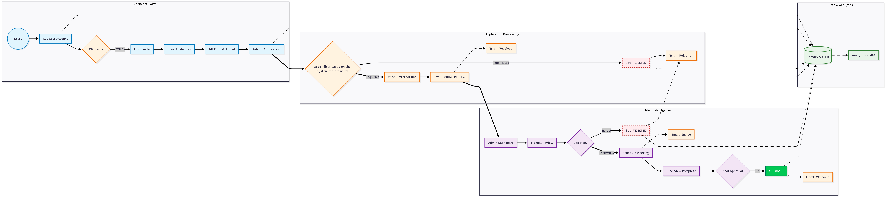

# Applicant Management System

A full end-to-end **Applicant Management System** built with **Java**, **Maven**, and a modular clean-architecture design.
This system handles everything from **account registration → automated screening → manual review → interviews → final approval → email notifications → data analytics**.

This README explains the project’s structure, workflow, setup, branching model, best practices, and contribution rules.

## Features

### **Applicant Portal**

* User registration
* 2FA verification
* Login & authentication
* Application form submission
* Document uploads
* Automated email notifications

### **Automated Filtering Engine**

* Rule-based eligibility checks
* Integration with external data sources
* Auto decision for PASS / FAIL
* Auto rejection emails for failed cases

### **Admin Dashboard**

* Manual review panel
* Application metadata view
* Interview scheduling
* Approve / Reject decisions
* Status tracking and audit logs

### **Final Approval System**

* Handles final decisions
* Sends welcome or rejection emails
* Updates database & analytics

### **Data & Analytics Layer**

* SQL database for all records
* Data extracted for reporting/ML
* Audit logs + processing stats

# Architecture & Workflow

Below is a textual breakdown of the system flow:

### **1. Applicant Journey**

1. Start
2. Register Account
3. 2FA Verification
4. Login
5. View Guidelines
6. Fill Application Forms
7. Upload Documents
8. Submit Application

This triggers the automated review engine.

### **2. Automated System Review**

1. Application enters rule-based auto-filter
2. If **Rejected** → auto email sent
3. If **Passed** → External Data Checks
4. System queues application for **Administrator Review**

### **3. Admin Processing**

1. Admin opens Dashboard
2. Review application
3. If rejected → the applicant gets a rejection email
4. If an interview is needed → schedule interview email sent
5. After interview → admin records results
6. Application moves to **Final Approval**


### **4. Final Approval**

1. Admin gives final decision
2. If approved → the applicant receives a welcome email
3. If rejected → rejection email sent
4. Data stored in SQL + sent to analytics module


### **5.Project Folder-Structure** 
````
ApplicationPortalBackend/
├── src/main/
│   ├── java/com/igirerwanda/application_portal_backend/
│   │   ├── admin/                    # Admin-related controllers and services
│   │   ├── application/              # Application management logic
│   │   ├── auth/                     # Authentication and authorization
│   │   ├── cohort/                   # Cohort management
│   │   ├── common/                   # Shared utilities and DTOs
│   │   ├── config/                   # Configuration classes
│   │   ├── me/                       # Self-service endpoints
│   │   ├── notification/             # Notification services
│   │   ├── review/                   # Review and evaluation logic
│   │   ├── scheduler/                # Scheduled tasks
│   │   ├── security/                 # Security classes (JWT, filters, etc.)
│   │   ├── user/                     # User management
│   │   └── ApplicationPortalBackendApplication.java   # Main application class
│   │
│   └── resources/                    # Configuration files (application.properties)
│
├── src/test/java/com/igirerwanda/application_portal_backend/
│   ├── controller/                   # Controller tests
│   ├── repository/                   # Repository tests
│   └── service/                      # Service tests
│
````

# Tech Stack

| Layer         | Technology                         |
| ------------- |------------------------------------|
| Backend       | Java 21+                           |
| Build         | Maven                              |
| Framework     | Spring Boot (recommended)          |
| Database      | PostgreSQL                         |
| Email         | SMTP (JavaMail / Spring Mail)      |
| External APIs | (ID verification, background checks, etc.) |
| Testing       | JUnit, Mockito                     |


# Git Branching Strategy

This project uses a **clean Git workflow**:

### **Main Branch**

`main`
  Production-ready
  Always stable

### **Development Branch**

`develop`
  Active development
  Merges from feature branches

### **Feature Branches**

`feature/<feature-name>`
Examples:

* `feature/auto-filter-engine`
* `feature/interview-module`

### **Bug Fix Branches**

`fix/<issue>`
Example: `fix/email-timeout`

### **Release Branches**

`release/v1.0.0`
  For final polishing
  Only bug fixes allowed

### **Hotfix Branches**

`hotfix/<critical-issue>`
  For urgent production fixes


# Best Practices

### **Coding Standards**

* Follow **SOLID principles**
* Use **dependency injection** everywhere
* Controllers must stay thin
* Services contain logic
* Repositories access DB only

### **Security**

* Hash all passwords (BCrypt)
* Use JWT or session-based authentication
* Validate all input fields
* Enable HTTPS
* Avoid exposing stack traces

### **Database**

* Use JPA / Hibernate
* Add indexes for frequently queried fields
* Use Flyway/Liquibase for DB migrations
* Normalize data where appropriate

### **Email Handling**

* Use pre-designed templates (HTML)
* Send emails asynchronously to avoid delays

### **Testing**

* Unit tests for services
* Integration tests for controllers
* Mock external API calls

### **Error Handling**

* Global exception handler
* Friendly API error responses
* Avoid exposing sensitive system info


# Running the Project (Development)

### Clone the Repo

``` sh
  git clone https://github.com/SheCanCODE-Capstone-Projects/Application-portal-backend.git
  cd  Application-portal-backend
```

### Build the Project

```sh
   mvn clean install
```

### Run the Application

```sh
   mvn spring-boot:run
```

### Open the App

* API: `http://localhost:8080/api`
* Admin Dashboard: (if applicable)

# Running Tests

```
mvn test
```

# Deployment

You can deploy using:

* Docker
* Render

### Docker build:

```sh
  docker build -t applicant-system .
  docker run -p 8080:8080 applicant-system
```

# Database Schema

* **users**
* **applications**
* **documents**
* **interviews**
* **decision_logs**
* **audit_logs**
* **external_checks**

(A full ERD is coming soon.)

# API Endpoints Example

### **POST /auth/register**

Register new users.

### **POST /auth/login**

Login & authenticate.

### **POST /application/submit**

Submit applicant data.

### **GET /admin/review**

Fetch applications awaiting admin action.

(API documentation coming soon.)


# Contributing

1. Fork the project
2. Create a feature branch

   ```
   git checkout -b feature/new-feature
   ```
3. Commit changes
4. Push branch
5. Open a Pull Request

--- 



